# Домашнее задание к занятию "`Оркестрация группой Docker контейнеров на примере Docker Compose.`" - `Прокутин ДВ`


---

### Задание 1

1. Предоставьте ответ в виде ссылки на https://hub.docker.com/<username_repo>/custom-nginx/general .

```
docker push dmitriyvp/custom-nginx:1.0.0 

https://hub.docker.com/repository/docker/dmitriyvp/custom-nginx/general
```

---

### Задание 2


1. Запустите ваш образ custom-nginx:1.0.0 командой docker run в соответвии с требованиями:

```
docker run -d --name "DVP-custom-nginx-t2" -p 127.0.0.1:8080:80 dmitriyvp/custom-nginx:1.0.0
docker rename "DVP-custom-nginx-t2" "custom-nginx-t2"

date +"%d-%m-%Y %T.%N %Z" ; sleep 0.150 ; docker ps ; ss -tlpn | grep 127.0.0.1:8080  ; docker logs custom-nginx-t2 -n1 ; docker exec -it custom-nginx-t2 base64 /usr/share/nginx/html/index.html

```
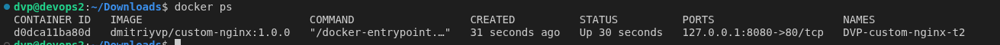
....
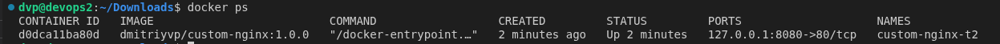
....
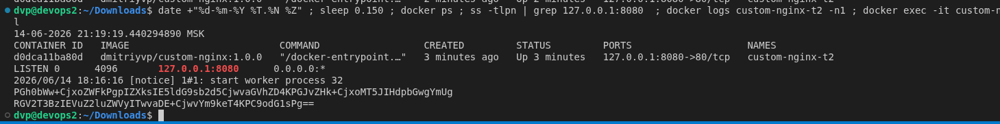
....
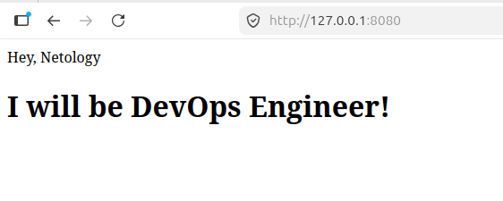


---

### Задание 3


3.  контейнер остановился потому что консоль была подключена к терминалу контенера и внутрь по команде ctl + c был послан SIGINT 
10.  потому что порт на nginx был изменен на 81 , теперь нужно перезапустить контейнер с параметром 127.0.0.1:8080:81

```
docker attach custom-nginx-t2
docker start custom-nginx-t2
docker exec -it custom-nginx-t2 bash
apt-get update
apt-get install -y nano
nano /etc/nginx/conf.d/default.conf
curl http://127.0.0.1:80  curl http://127.0.0.1:81.
....
....
....
```

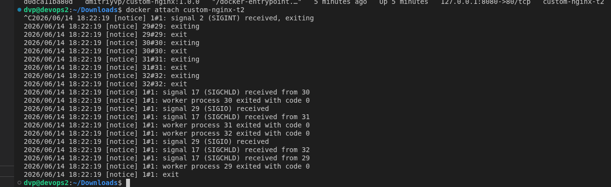
....
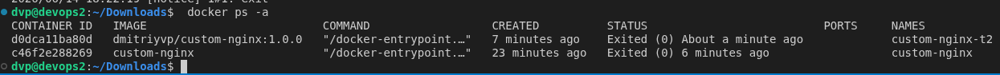
....
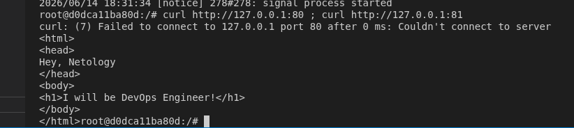
....
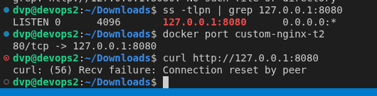


### Задание 4

1. `Заполните здесь этапы выполнения, если требуется ....`


```
docker run -d --name centos_container -v $(pwd):/data centos:centos7.9.2009 tail -f /dev/null
docker run -d --name debian_container -v $(pwd):/data debian:latest tail -f /dev/null

docker exec -it centos_container bash
echo "test file" > /data/file_from_centos.txt
exit

echo "test file on the host machine" > file_from_host.txt

docker exec -it debian_container bash
ls -la /data


```

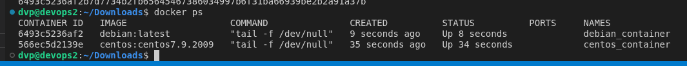
....
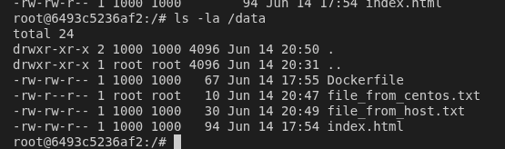


### Задание 5


1. compose.yaml в приоритете запуска по умолчанию , если не указан конкретный файл
2. нужно дополнить include вторым файлом для запуска 
7. Found orphan containers ([tmp-portainer-1]) for this project. If you removed or renamed this service in your compose file, you can run this command with the --remove-orphans flag to clean it up.  - предупреждение о "осиротевших" контенерах , контейнер существует - в а yaml файлах нет его описания


```
include:
  - docker-compose.yaml
....
docker tag custom-nginx:latest localhost:5000/custom-nginx:latest
docker push localhost:5000/custom-nginx:latest

....
Found orphan containers ([tmp-portainer-1]) for this project. If you removed or renamed this service in your compose file, you can run this command with the --remove-orphans flag to clean it up. 

docker compose down -v --remove-orphans
....
```

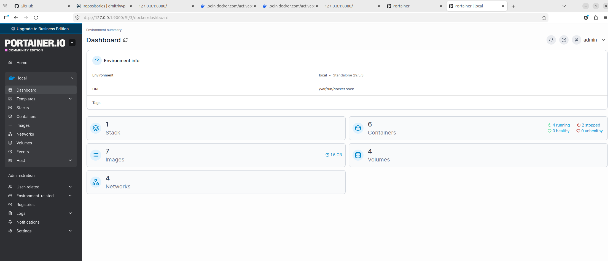
....
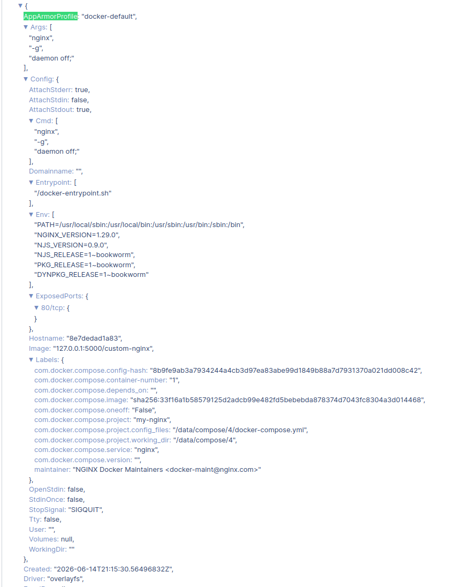
....
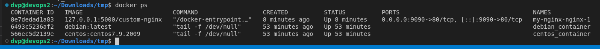